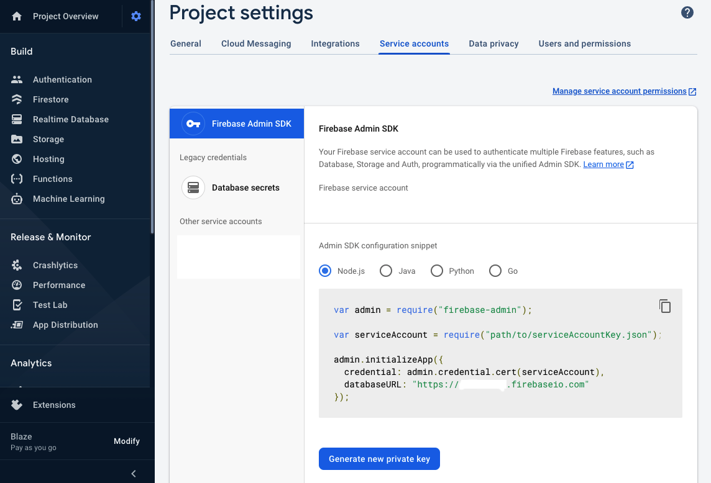
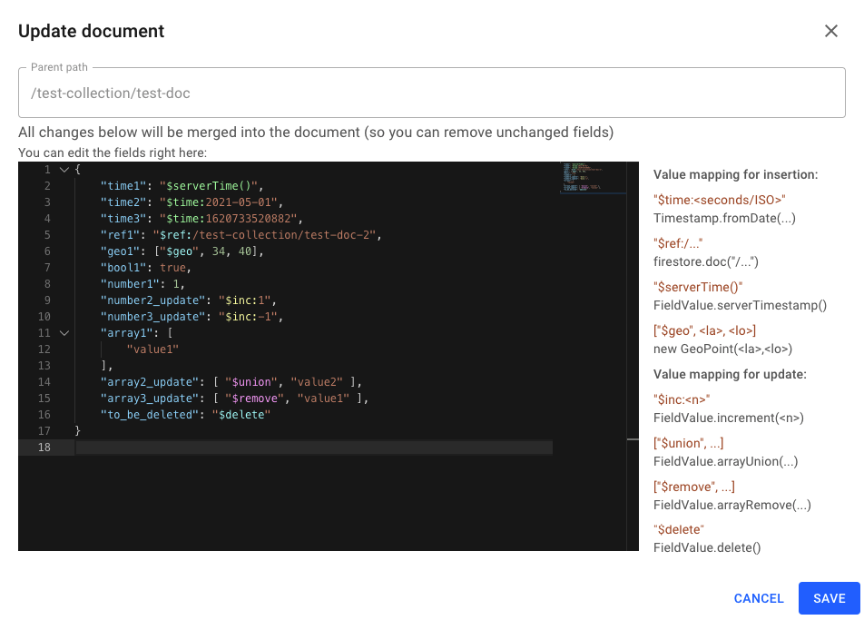

## Blazestore

GUI for Firestore Admin SDK (inspired by the official firestore console)

### Usage

- Clone this repository
- Throw your service account JSON files into `/applications`
  - IMPORTANT: Your files will be ignored by Git (there is a `.gitignore` file in there)
  - See instructions below how to obtain a service account
- Create another file for each of the service account files (same folder).

e.g. `my-app.json` (in addition to `my-app-service-account-af2cb2364.json`)
```json
{
  "type": "firestore",
  "project_id": "my-app",
  "database_url": "https://my-app.firebaseio.com"
}
```
- Install dependencies `npm install`
- Run the app by `npm start`
- Open browser on `http://localhost:3030`

### How to create a service account

1. Go to [Firebase console](https://console.firebase.google.com/)
2. Open your project's settings.
3. At the "Service accounts" tab, click the "Generate new private key" (Node.js chosen)



### Update documents fields syntax

